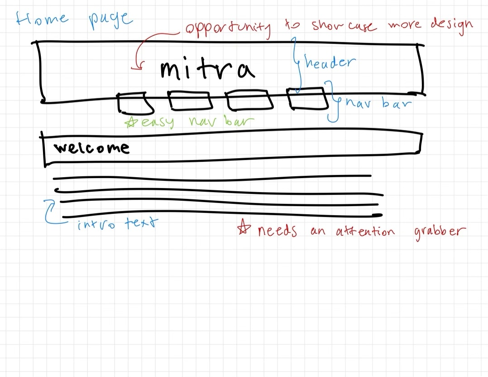
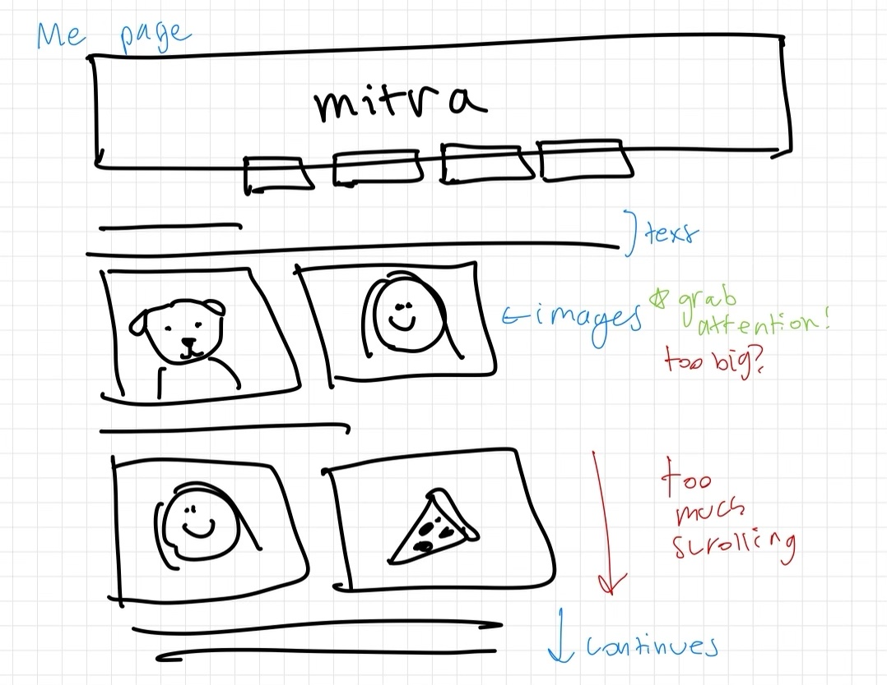
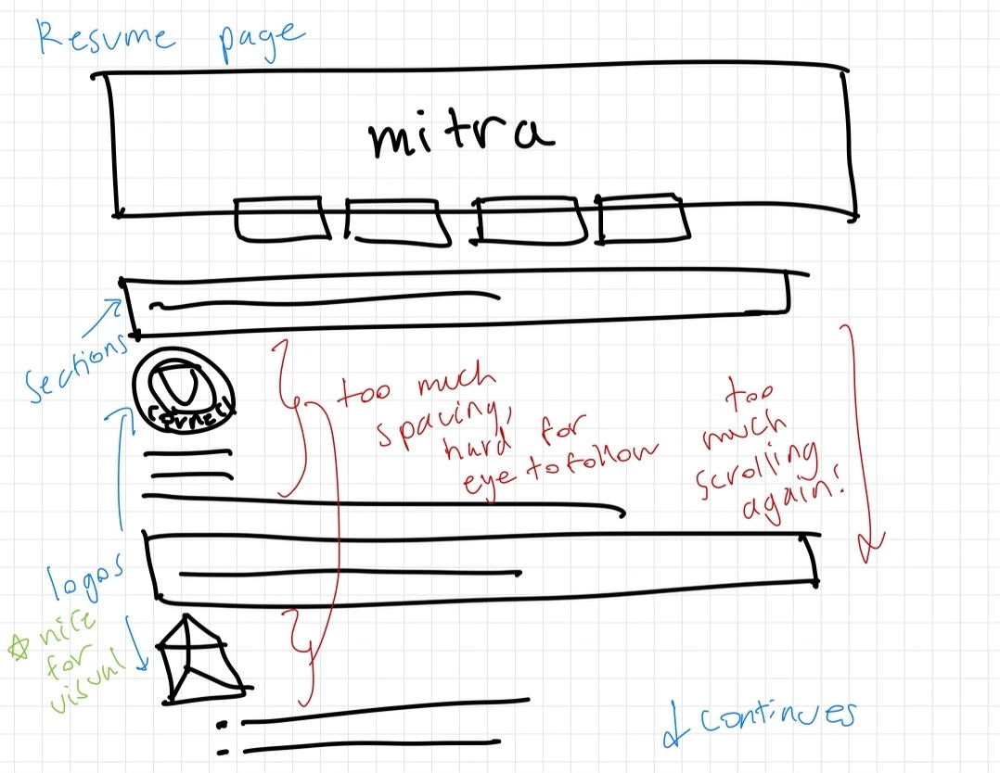

# Project 1: Design Journey

**For each milestone, complete only the sections that are labeled with that milestone.** Refine all sections before the final submission. If you later need to update your plan, **do not delete the original plan, leave it place and append your new plan below the original.** Explain why you are changing your plan. Remember you are graded on your design process. Updating the plan documents your process!

**Replace ALL _TODOs_ with your work.** (There should be no TODOs in the final submission.)

Be clear and concise in your writing. Bullets points are encouraged.

**Everything, including images, must be visible in Markdown Preview.** If it's not visible in Markdown Preview, then we won't grade it. We won't give you partial credit either. Your design journey should be easy to read for the grader; in Markdown Preview the question and answer should have a blank line between them.

## Existing Design (Milestone 1)

**Make the case for your decisions using concepts from class, as well as other design principles, theories, examples, and cases from outside of class (includes the design prerequisite for this course).**

You can use bullet points and lists, or full paragraphs, or a combo, whichever is appropriate. The writing should be solid draft quality.

### Existing Site: The Site (Milestone 1)
> What is your existing site about? Tell us about it.

My existing site is my personal website. It includes all the information that may be important to a user trying to learn more about me. There are pages for my interests and personality traits, my resume, and my contact information. It is meant to be a representation of the parts of me that I am proud of and that represent me.

> How and where did you create this site?

I created this site as one of my assignments for INFO1300, but I made minor adjustments in the files I added to this project in order to have updated information on my resume and fix a CSS contrast error I was getting when testing the site. I wanted to use this site for this project because I like how personalized it is and I like the way I had designed the site.

> Is this site designed for desktop, mobile devices or both?

It is designed for desktop, but it still works on large tablets.

### Existing Site: Audience (Milestone 1)
> Who is your _existing_ site's audience?
> Briefly explain who the intended audience(s) is for your website. Be specific and justify why this audience is appropriate for your site. You may not be the audience.

The audiences for my site are job recruiters for positions I have showed interest in or for posiitons I would be a good fit for, as well as students who would like to network and connect with me. Job recruiters are the primary audience because they would need to see my resume with my experiences and credentials in order to see if I am qualified for a specific position, and would likely find my personality helpful to see if I'd be a good fit into a specific company culture. Other students would also be a potential audience because I know that many students look to each other for advice - whether it is about clubs and extracurriculars or classes and majors. I believe that students who resonate with my interests and academics would be interesting in connecting with me and learning more about me through my website.

### Existing Site: Audience Needs (Milestone 1)
> Document your existing site's audience's goals. (These should be informed by user research. Not assumptions.)
> List each goal below. There is no specific number of goals required for this, but you need enough to do the job.
> You may copy these from your previous project. However, I would encourage you to refine them.

Goal 1: Straightforward
- **Design Ideas and Choices** _How will you meet those goals in your design?_
  - I will make sure that there is no unnecessary content to distract from the important information I am displaying and that the pages in the navigation bar are thoughtfully chosen to avoid clicking around too much.
- **Rationale & Additional Notes** _Justify your decisions; additional notes._
  - Users will probably be looking for certain aspects of my personal website and won't need to see it all at once. The site shouldn't distract them from relevant parts of my resume and personality because then important elements might be overlooked.

Goal 2: Aesthetically pleasing
- **Design Ideas and Choices** _How will you meet those goals in your design?_
  - The site will be pleasant to look at and use colors that follow the contrast rules to make for easy reading. The layout of the site will also be enjoyable to look at and follow a natural eyeline of users.
- **Rationale & Additional Notes** _Justify your decisions; additional notes._
  - Since users may be interested in my graphic design experience I detailed on my site, I want to make sure the site also shows that I have good taste in web design as well to back up my experience.

Goal 3: Informative
- **Design Ideas and Choices** _How will you meet those goals in your design?_
  - I will make sure that the site contains all the information my users may need. This includes my intro, resume, fun facts, and contact information.
- **Rationale & Additional Notes** _Justify your decisions; additional notes._
  - A job recruiter would need to see my resume which includes my work experiences and skills. A fellow student looking for someone with similar interests would want to see my extracurriculars on my resume as well. Both user groups would want to learn about my personality to see if I'd be a compatible team member, intern, or friend. The contact page is also essential for either group to contact me about a job or an inquiry.

### Existing Site: Design/Sketches (Milestone 1)
> Sketch your existing site. Include these sketches here.
> DO NOT COPY SKETCHES FROM THE ORIGINAL ASSIGNMENT!
> Create new sketches here. This is part of the design process to get you thinking about the strengths/weaknesses of the current design.
> Provide a brief explanation _underneath_ each sketch.

For each page, I first sketched the existing design in black, then explained elements in blue, flagged concerns in red, and pointed out strengths in green. The home page is a simple header and nav bar with an intro blurb. I noticed that the user may be disinterested by the lack of content on this page.

The me page highlights my interests, passions, and personality traits. I used images to bring my text to life. I noticed that there may be too much horizontal scrolling, but I did think the images made the page more attention grabbing.

The resume page has different sections like education, work experiences, and skills with blurbs underneath them. I noticed that, again, there was too much vertical scrolling and that the text was spaced/formatted in a way that may not follow a user's natural eye movements.

The contact page has my phone number and email address linked. I immediately noticed this page had too much blank space and no content to interest the user apart from my contact information.

## Refined Design (Milestone 2)

### Refined Design: Persona (Milestone 2)
> Use the goals your identified above from user research to develop a persona of your site's audience.
> Your persona must have a name and a "depiction". This can be a photo of a face or a drawing, etc.
> There is no required format for the persona.
> You may type out the persona below with bullet points or include an image of the persona. Just make sure it's easy to read the persona when previewing markdown.

Persona's Name: TODO

TODO: (the rest of the persona)

### Refined Design: Content Organization/Navigation (Milestone 2)
> Identify the content that is necessary for your persona. **Refer to the persona by name.**
> List the content here. Label the content as "(new)" if it's new to the existing site.
> **Don't forget to include the form.**

- (Example) Cornell Admissions Process (delete this line)
- (Example) Cornell Admission Stats (new) (delete this line)
- TODO
- TODO
- ...

> Organize the content for the audience and identify possible pages for the content using card sorting.
> Document your card sorting by taking a photo and including it here.
> You are **required** to show the alternative organization you considered. (1 card sort is not enough)

TODO

> Explain your thought process behind the card sorting. **Refer to the persona by name in your explanation.**

TODO

> Lastly, list the pages that resulted from your final card sort (i.e. your site's navigation) and content for each page.

- (Example) Home (delete these example lines)
  - (Example) List of colleges
  - (Example) New research
- (Example) Admissions
  - (Example) admissions criteria
- TODO
- TODO
- ...

### Refined Design: Design (Milestone 2)
> Refine the design of your site to meet the goals of your users using your persona.
> Include sketches of each page of the refined design.
> Provide a brief explanation _underneath_ each sketch.
> Document your _entire_ design process. **Show your preliminary sketches and your final sketches.** **We want to see iteration!** You must have multiple iterations of each page for full credit.
> **Refer to your persona by name in each explanation.**

TODO

### Partial Plan (Milestone 2)
> Using your refined sketches, plan your site's partials.
> You may describe each partial or sketch it. It's up to you!

TODO

## Complete & Polished Website (Final Submission)

### Routing (Final Submission)
> Plan your dynamic HTTP routing.
> List each route and the PHP file for each route.

| Route | PHP File                            |
| ----- | ----------------------------------- |
| /     | pages/home.php (or pages/index.php) |
| TODO  | TODO                                |
| TODO  | TODO                                |

### Audience (Final Submission)
> Tell us how your final site meets the needs of the audience. Be specific here. Tell us how you tailored your design, content, etc. to make your website usable for your persona. **Refer to the persona by name.**

TODO

### Accessibility Audit
> Tell us what issues you discovered during your accessibility audit.
> What do you do to improve the accessibility of your site?

TODO

### Additional Design Justifications (Final Submission)
> If you feel like you haven’t fully explained your design choices in the final submission, or you want to explain some functions in your site (e.g., if you feel like you make a special design choice which might not meet the final requirement), you can use the additional design justifications to justify your design choices. Remember, this is place for you to justify your design choices which you haven’t covered in the design journey. You don’t need to fill out this section if you think all design choices have been well explained in the design journey.

TODO

### Self-Reflection (Final Submission)
> Reflect on what you learned during this assignment. How have you improved from 1300? What things did you have trouble with?

TODO

> Take some time here to reflect on how much you've learned since you started this class. It's often easy to ignore our own progress. Take a moment and think about your accomplishments in this class. Hopefully you'll recognize that you've accomplished a lot and that you should be very proud of those accomplishments!

TODO

### Grading: Mobile or Desktop (Final Submission)
> When we grade your final site, should we grade this with a mobile screen size or a desktop screen size?

TODO

### Grading: Partials (Final Submission)
> Clearly list each partial file and where you used it.

- TODO
- TODO

> Which partials have customization? Explain how the customization looks in the browser.

- Example: header.php shows a border around the current page (TODO: delete this line)
- TODO

### Grading: Open the Design Journey in Markdown Preview
> Preview your design journey in VS Code. Please verify that this document is easy to read/grade.
> - All images must be visible.
> - All images must be oriented the correct way.
> - There should be a blank line between the question prompt and your answer.
> Is your design journey easy to read?

TODO
